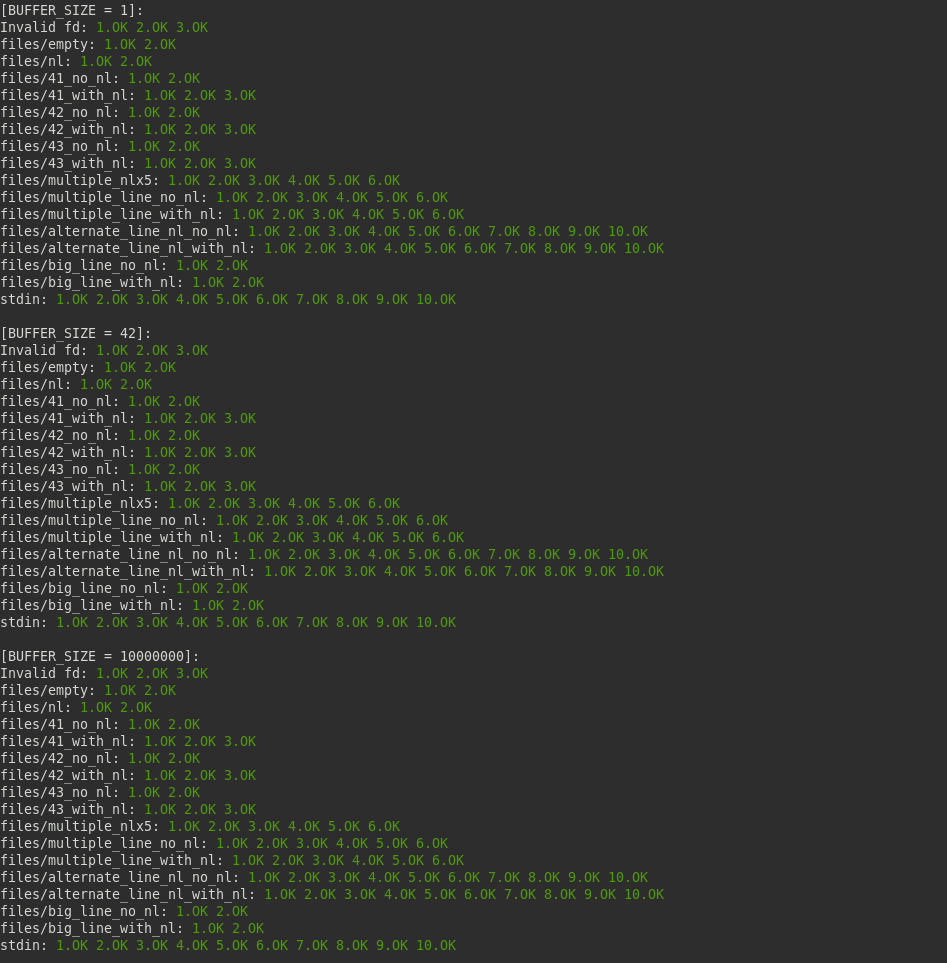
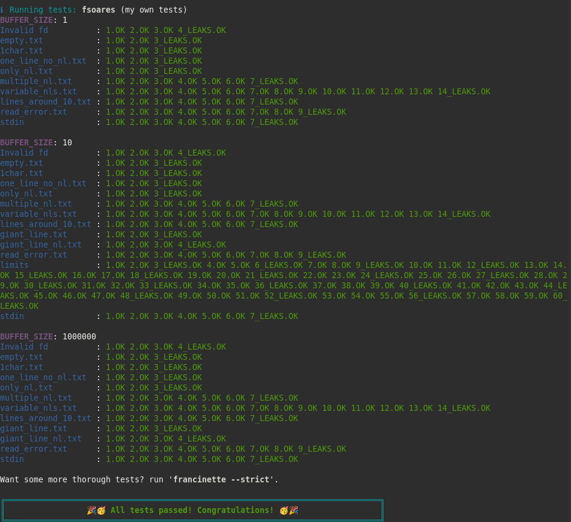
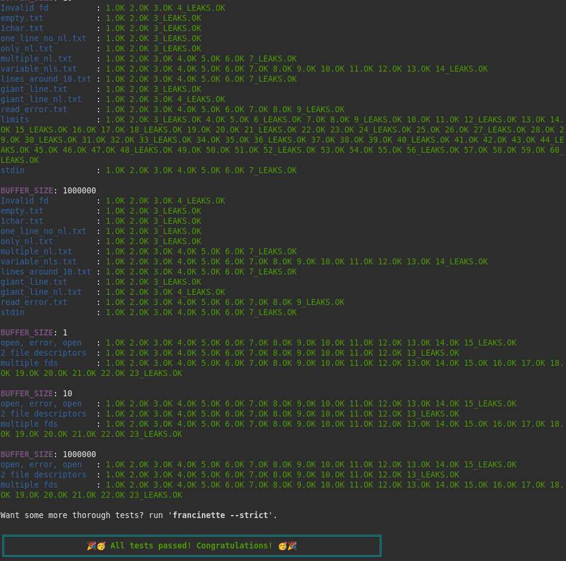

  <!-- Logo -->
  

  <!-- Project Name -->
  <h1>Get Next Line Project</h1>

  <!-- Short Description -->
  
42 Porto get_next_line

 

  <!-- Badges -->
  

    
    
    
    
    
    
  

  <!-- Tree -->
<h4>
    <a href="https://github.com/knoxvillie/libft" target="_blank">:large_blue_diamond: View Demo</a>
   · 
    <a href="https://github.com/knoxvillie/libft" target="_blank">:beetle: Report Bug</a>
   · 
    <a href="https://github.com/knoxvillie/libft" target="_blank">:speech_balloon: Request Feature</a>
</h4>

  <!-- Subject -->
 
  <a href="subject.pdf"><strong>Explore the Subjetc »</strong></a>
 
 

  <h2>:star2: About The Project</h2>
  

   The goal of the project is to create a script that opens a text file in read mode and reads a predefined amount of bytes <em>BUFFER_SIZE</me>, until the end of a line is reached. When the number of bytes in the line is not a multiple of <em>BUFFER_SIZE</me>, the read function will read bytes that do not belong to the line in question, but to the next line. As a result, this project reads and returns one line at a time from a file, whenever the get_next_line function is executed.
  The bonus part handles multiple text files simultaneously.
  

  <h2>:dart: Table of Contents</h2>

  
Mandatory Part One

  <ul>
  

    
get_next_line.c

    
Allocates (with malloc(3)) and returns a string representing the integer received as an argument.Negative numbers must be handled.

    

  

    
get_next_line.h

    
Outputs the character 'c' to the given file descriptor.

    

  

    
get_next_line_utils.c

    
Outputs the string 's' to the given file descriptor followed by a newline.

    

  </ul>

  
Bonus Part

  <ul>
  

    
ft_lstadd_back.c

    
Adds the node 'new' at the end of the list.

    

  

    
ft_lstadd_front.c

    
Adds the node 'new' at the beginning of the list.

    

  

    
ft_lstclear.c

    
Deletes the given node and every successor of that node, usign the function 'del'. Finally, the pointer to the list must be set to NULL.

    

  

    
ft_lstdelone.c

    
Takes as a parameter a node and frees the memory of the node's content usign the function 'del' given as a parameter and free the node.

    

  

    
ft_lstiter.c

    
Iterates the list 'lst' and applies the function 'f' on the content of each node.

    

  

    
ft_lstlast.c

    
Return the last node of the list.

    

  

    
ft_lstmap.c

    
Iterates the list 'lst' and applies the function 'f' on the content of each node.

    

  

    
ft_lstnew.c

    
Allocates (with malloc(3)) and returns a new node. The member variable 'content' is initialized with the value of the parameter 'content'.

    

  

    
ft_lstsize.c

    
Counts the number of nodes in a list.

    

  </ul>

 <!-- Contributing -->
<h2>:wave: Contributing</h2>

Special thanks to <a href="https://github.com/AlexMitcul" target="_blank"><strong>AlexMitcul</strong></a> for helping with the documentation.

 
Contributions are what make the open source community such an amazing place to learn, inspire, and create. Any contributions you make are **greatly appreciated**.

If you have a suggestion that would make this better, please fork the repo and create a pull request. You can also simply open an issue with the tag "enhancement".
Don't forget to give the project a star! Thanks again!

1. Fork the Project
2. Create your Feature Branch (`git checkout -b feature/AmazingFeature`)
3. Commit your Changes (`git commit -m 'Add some AmazingFeature'`)
4. Push to the Branch (`git push origin feature/AmazingFeature`)
5. Open a Pull Request

<h2 align="center">:wrench: Running Tests</h2>
<h4 align="center">
  <a href="https://github.com/xicodomingues/francinette" target="_blank">:paperclip: Francinette</a>
 · 
  <a href="https://github.com/Tripouille/gnlTester" target="_blank">:paperclip: gnlTester</a>
 
 
</h4>
<h3 align="center">:camera: Screenshots</h3>

  
  
  

  
  

